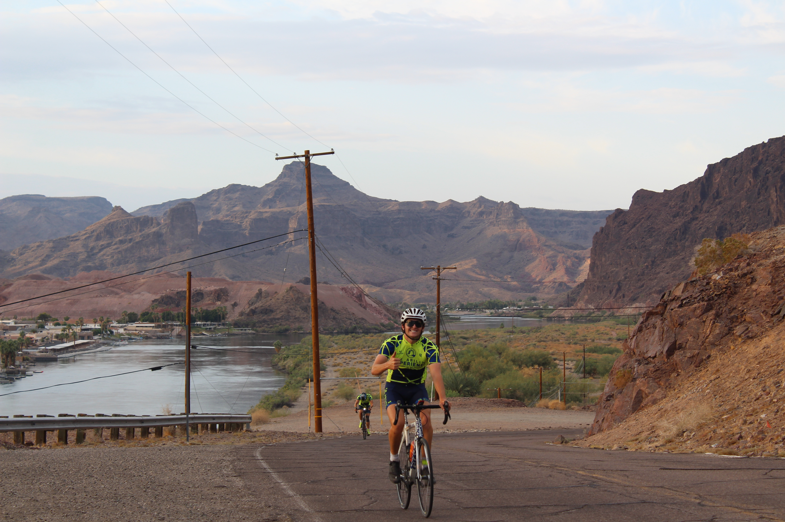

# Deep Learning Engineer

#### Technical Skills: Python (Tensorflow/Keras, Pytorch, Numpy, Pandas), MATLAB, RStudio 

## Education
- M.S, Mechanical Engineering | California Polytechnic State University, San Luis Obispo _June 2024_
- B.S, Mechanical Engineering | California Polytechnic State University, San Luis Obispo _June 2023_

Relevant Coursework: CS 587 - Advanced Deep Learning | CPE 428 - Computer Vision | STAT 419 - Multivariate Statistics
## Work Experience
**Graduate Research Assistant, NSF Grant | _December 2022 - Present_** ([Research Lab Webpage](https://ericwadelab.github.io/))
- Developed algorithms to analyze electromyography (EMG) and acceleration data from wearable armband, with the end application to classify upper extremity movement of  individuals post-stroke
- Designed and implemented research procedures on human subjects; organized data collection procedure to align with Internal Review Board (IRB) standards
- Applied machine learning techniques of principal component analysis (PCA), data augmentation, developed deep neural network architecture
- Worked with thesis advisor to publish IEEE conference paper, IEEE journal paper, and thesis within 1.5 year timeframe

  

**Mechanical Engineering Intern, Telos Health | _July 2023 - September 2023_, San Jose CA**
Utilized 3-D printing techniquesm including PLA and SLA, to rapidly design, assemble, and test prototype for fluid line management system of complex robotics architecture. Designed electrical enclosure to facilitate management of power supplies and wiring. Excelled in early-stage startup environment with a goal of developing a robotics system.

**Mechanical Engineering Intern, Pacific Design Technologies(PDT) | _June 2022 - August 2022_, Santa Barbara CA**
Designed and optimized MATLAB algorithm to analyze fluidics mixing valve data for PDT / NASA JPL engineering team. Utilized _signal processing toolbox_ to take derivative of data, run _findpeaks()_ function, and automatically detect testing locations in data, saving engineering team hours of manual segmentation. 

## Projects
### Novel Deep Learning Architecture to Monitor Upper Extremity Behavior
Journal paper in-progress, see [contribution 2](https://github.com/doddfatherr/Thesis-2024/blob/main/Thesis_ND2024.pdf) of thesis document.

Using Tensorflow/Keras libraries, developed novel BiDirectional Long-Short-Term (BiLSTM) Recurrent Neural Network (RNN) to analyze Electromyography(EMG) and classify human activity. Developed an in-home research procedure to collect data, segmentation and classification algorithm in **Python**, data processing pipeline using **MATLAB**, and model in _Google Colab_. Empirically determined optimal model hyperparameters to achieve a model F1-score of _94%_, comprable to many published works.
Compared model to other state-of-the-art models in EMG analysis, including convolutional neural-network (CNN)-LSTM, Transformer-LSTM hybrid models. 

### Predicting Grip Aperture using Forearm Muscle Activation Data
[Publication currently in press](https://github.com/doddfatherr/Thesis-2024/blob/main/IEEE_EMBC_Paper.pdf)

[Conference Poster]([https://github.com/doddfatherr/Thesis-2024/blob/main/IEEE_EMBC_Paper.pdf](https://github.com/doddfatherr/Thesis-2024/blob/main/EMBC%20Poster_v1.pdf)) 

Designed and carried out data collection procedure on 10 participants to determine relationship between grip aperture (distance between thumb and forefinger) and forearm EMG. Developed novel computer vision algorithm to accurately capture aperture using _OpenCV_ grayscale, gaussian blur, and binary/adaptive thresholding techniques to track finger location. Performed descriptive statistics analysis in Rstudio. Work presented and published at IEEE Engineering in Medice Biology Society (EMBS) 46th annual conference.

### ME 507 - Advanced Control System Design Final Project | _April 2024 - June 2024_
In a team of 2, developed a machine vision approach to a pick-and-place system. Using an Ender v3 3-D printer frame, desigend PCB to read input from _OpenMV_ breakout board, locate a target object, and move payload above target. Took team lead for developing object-oriented micropython and C/C++ code to locate target location on _OpenMV_ board, read sensor input from limit switches, and actuate motors. Final PCB did not successfully work, however developed working system using breadboard, STM32F411 MCU.

### Cal Poly Senior Project, Maxar Technologies | _September 2022 - June 2023_ , Palo Alto CA
Participated in team of four to design, assemble, and test a proof-of-concept spacecraft center of gravity calculator. Utilized load cell array to calculate mass, triangulate location, and move a "pick point" above calculated location. Took on team lead of motor control, utilizing Arduino MCU to read input from load cell array and actuate three stepper motor - linear actuator systems. Developed Abaqus FEA model to ensure structural system withstood loads, leading to redesign of system. Excelled in year long project to meet final deliverable goals with Maxar engineering team.

## Leadership and Activities
### Teaching Associate | California Polytechnic State University, San Luis Obispo _September 2023 - June 2024_
Classes Taught: ME 251 - Intro to Detailed Design, ME 129/130 - Introduction to Mechanical Engineering II/III
Instructed 3 different mechanical engineering undergraduate 3 hour lab sections, each of 28+ students and 2 grading assistants. Taught SolidWorks principles to freshmen/sophomore throughout 10 week course, conveying topics such as engineering detailed drawings, hand drafting techniques, and GD&T fundamentals.  

### Journey of Hope Cyclist | The Ability Experience _June 2021 - August 2021_
Volunteered in fraternity national philantropy event where I cycled 3,663 miles from Santa Barbara, CA to Washington D.C to raise money and awareness for people with disabilites. Participated in "friendship visits" with 21 disability resource organizations across the country over 59 days. Personally fundraised $7000+ over 5 months leading up to trip departure. I was named local fraternity chapter brother of the year and an event team captain for training the most miles out of 20 cyclists.

  
  

### Surfboard Shaping Instructor | California Polytechnic State University, San Luis Obispo _September 2021 - June 2024_
Facilitated a 6-week project-based course to handshape a surfboard from a polyurethane foam "blank." Instructed multiple classes of 6 students per quarter, ensuring each student's final product matches their specifications. Designed original surfboards from concept to schematic, prototype to final product with each student.

  
  

